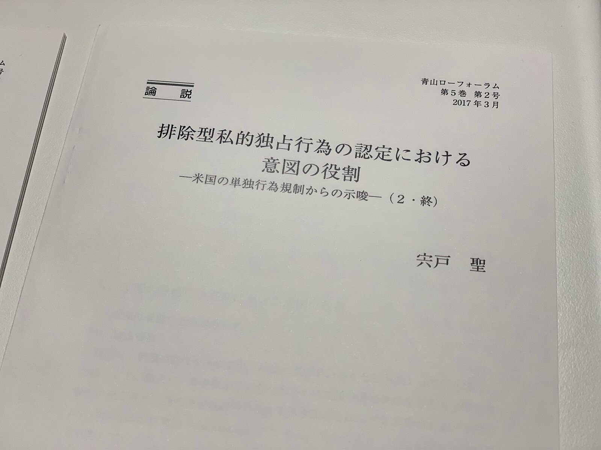

昨年公開された修論の公表論文の後編です．実際に執筆したのは2015年頃なので，特に治したい箇所が多いです．今後の論文の中で修正出来るように努めていきますのでご笑覧ください．

> **[CiNii 論文 - 排除型私的独占行為の認定における意図の役割 : 米国の単独行為規制からの示唆(2・終)](http://ci.nii.ac.jp/naid/120006028585)**
>
> 排除型私的独占行為の認定における意図の役割 : 米国の単独行為規制からの示唆(2・終) 宍戸 聖 青山ローフォーラム = Aoyama law forum : ALF 5(2), 235-268, 2017-03
