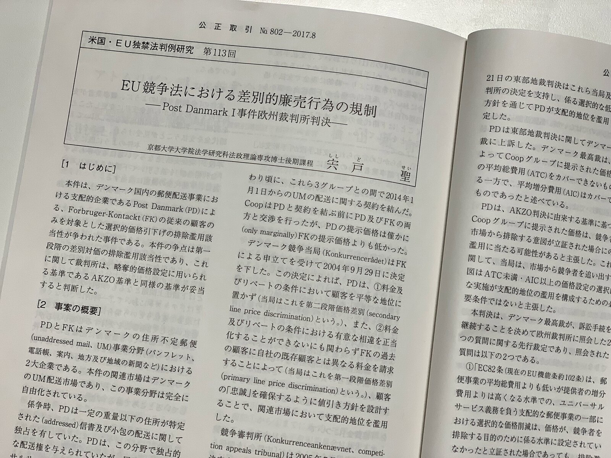

以前独禁法研究会において報告した内容をもとに執筆した評釈が、8月号の公正取引で掲載されました。

Post Danmark I判決は非常に短い判決ではありますが、その文言に解釈の余地が多く残されているため、難しい判決でもあります。

同判決は最新のIntel判決（司法裁判所）でも引用されており、この判決をどのように読み込むのかを考えることが、最新の忠誠リベートに関する判決の解釈においても重要となってくるという意味でも意義のある判決です。

> **[CiNii 論文 - 米国・EU独禁法判例研究(第113回)EU競争法における差別的廉売行為の規制 : Post Danmark Ⅰ事件欧州裁判所判決](http://ci.nii.ac.jp/naid/40021313354)**
>
> 米国・EU独禁法判例研究(第113回)EU競争法における差別的廉売行為の規制 : Post Danmark Ⅰ事件欧州裁判所判決 宍戸 聖 公正取引 (802), 80-85, 2017-08
