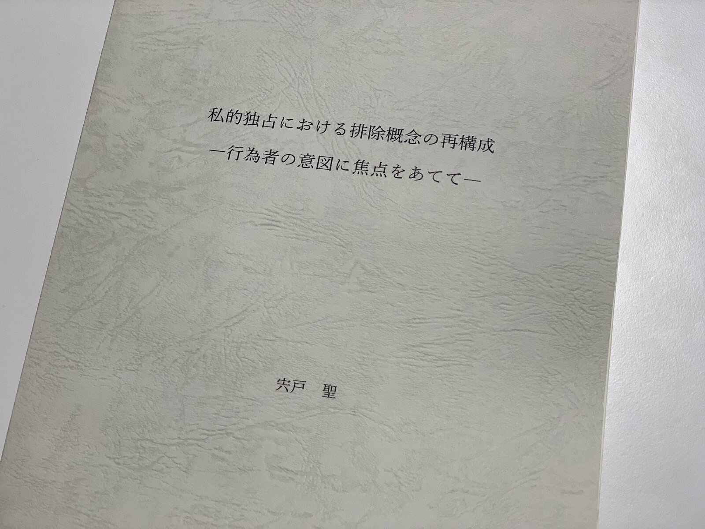

博士論文の口頭試問も終わり、無事に博士後期課程を修了できることになりました。論文の内容は、私的独占としての不当な排除の識別における行為者の意図の役割に関して、単独の取引拒絶と不当廉売に焦点をあてて論じたものです。

> **[Kyoto University Research Information Repository: 私的独占における排除概念の再構成―行為者の意図に焦点をあてて―](https://repository.kulib.kyoto-u.ac.jp/dspace/handle/2433/242337)**
>
> Export to RefWorks このリポジトリに保管されているアイテムはすべて著作権により保護されています。Powered by DSpace 5.6.0 and JAIRO Crawler-List version 1.1All items in KURENAI are …
