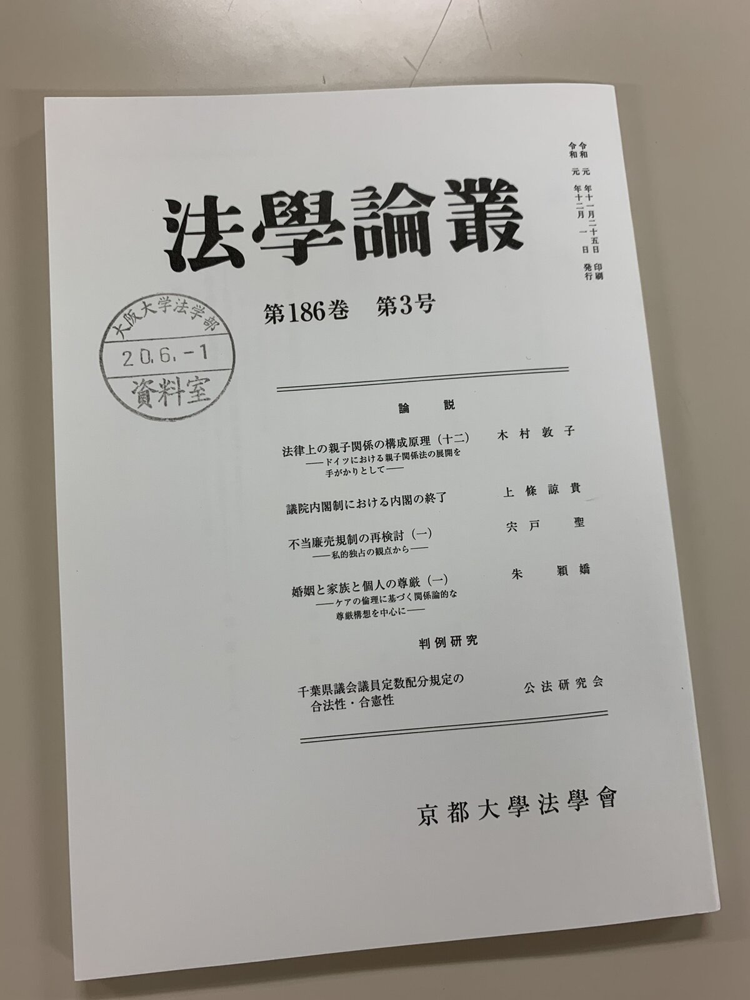
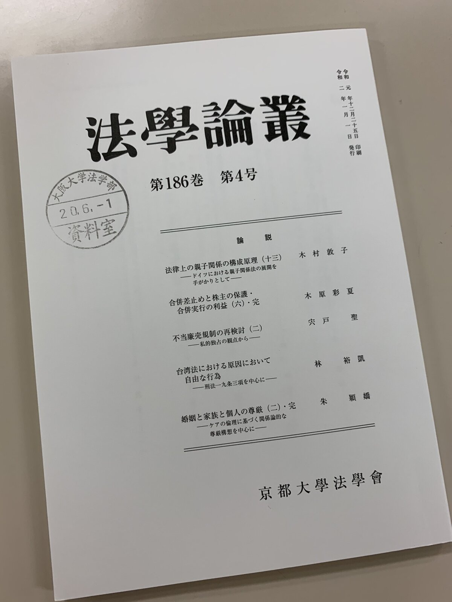
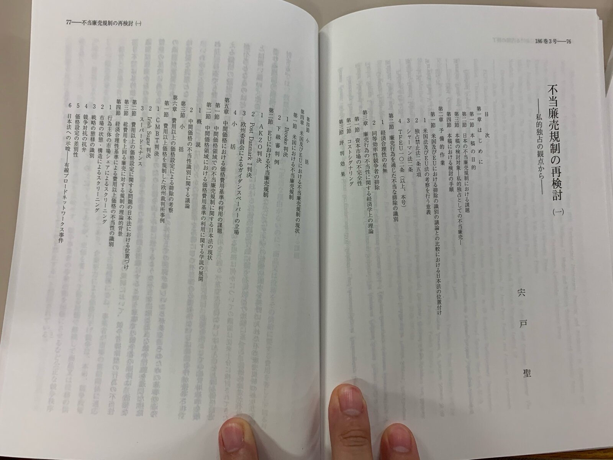

京都大学法學会が刊行する法学論叢の186巻第3号・第4号に不当廉売に関する論文が掲載されました。事務的な都合により刊行が遅れていたため、掲載されたのは昨年12月号・今年の1月号なのですが、実際に手元に雑誌が届いたのは6月を過ぎてからになってしまいました。

この論文は博士論文の一部を再構成、加筆したものです。

この論文で扱っているのは、不当廉売規制のうち、価格と費用の比較分析によっては価格設定の不当性が識別できないような価格領域に関して、廉売の不当性をどのようにして識別するのかという課題です。

  

なお、この論文は（4）まで続きます。

