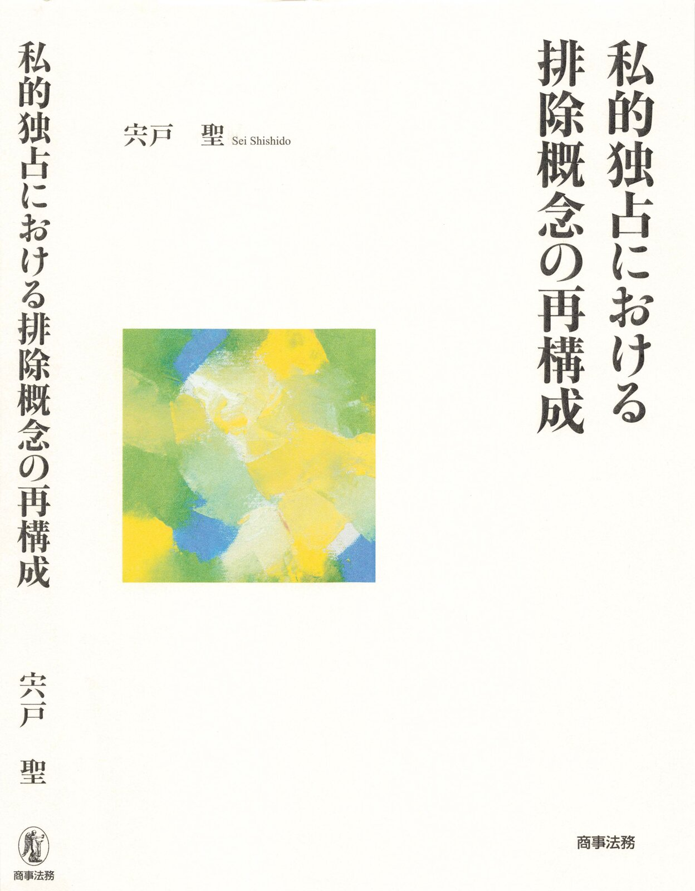
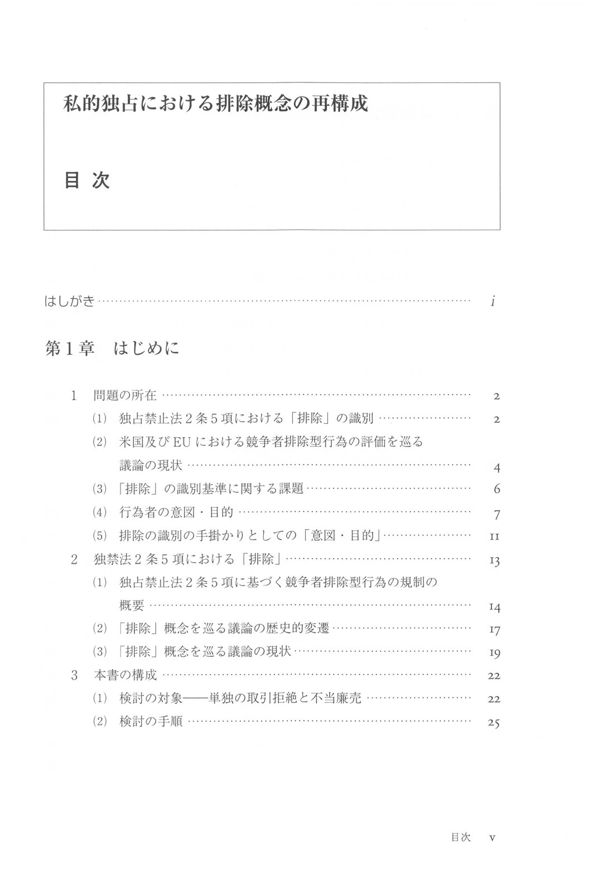
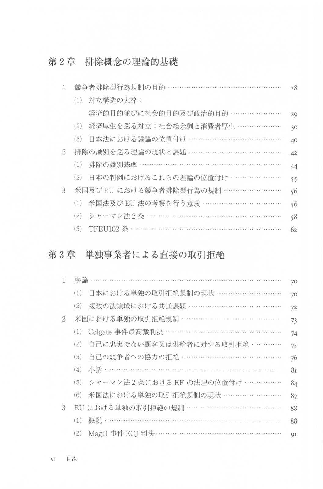
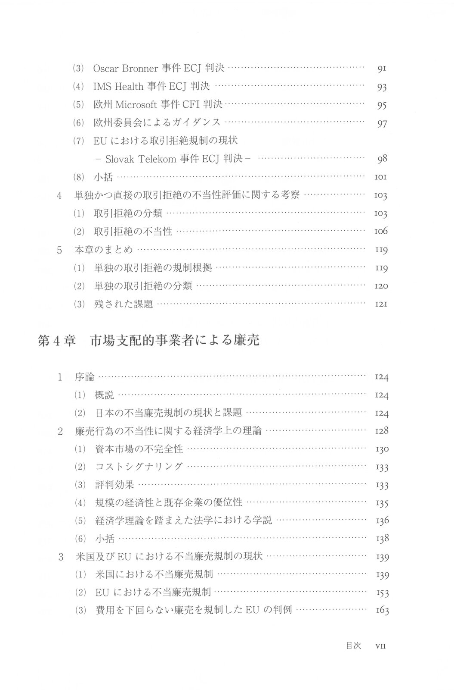
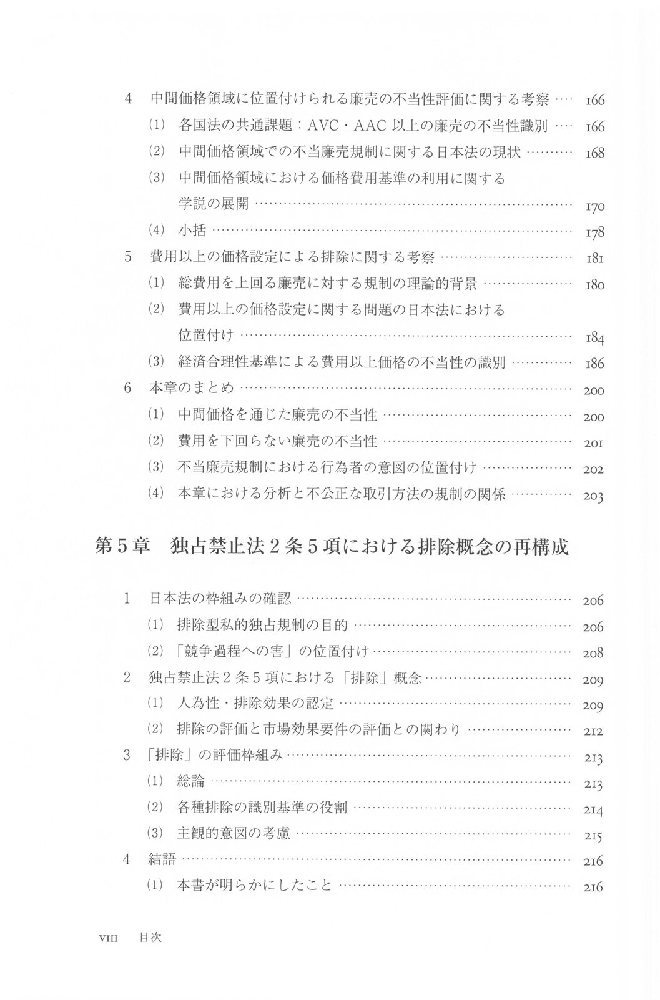
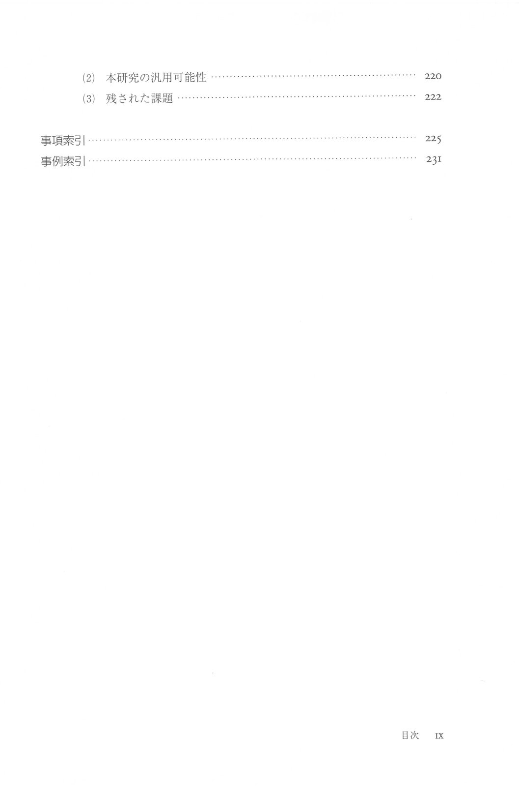

『私的独占における排除概念の再構成』が2022年4月8日に発売予定です。

https://amzn.to/34ghxz6

内容は、これまで2016年くらいから取り組んできた博士論文の研究や、ポスドク時代に取り組んでいた研究の成果をまとめたものになります。特に、競争法の目的を巡る分析や、排除概念に対する総括的な整理・分析について、約2章分は書籍企画のために新たに書き下ろしています。

まだ出版社のホームページでは公開されていませんが、目次は下記のとおりです。

