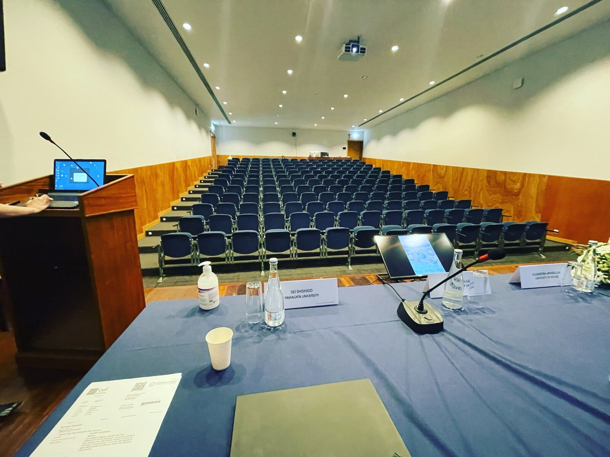
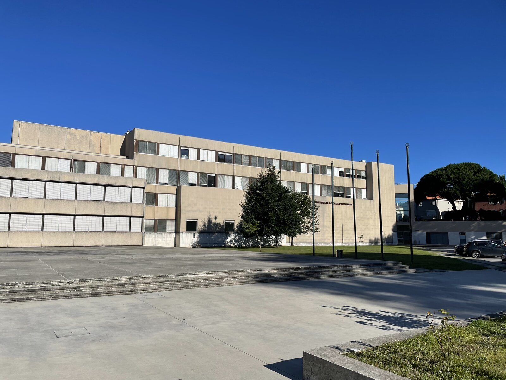
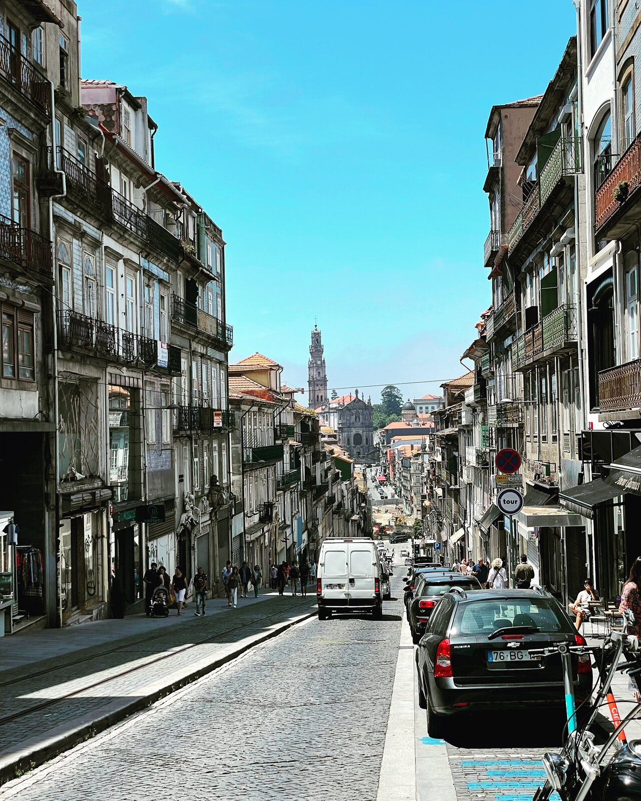

公益財団法人KDDI財団より海外学会等参加助成を受けて、ポルトガルのポルトにあるUniversidade Católica Portuguesaで開催されたASCOLA（academic society for competition law）2022年度大会に参加し、費用を下回らない廉売の違法性評価に関する研究報告をしました。

  

いわゆる「学会報告」は日本語でもしたことなかったので緊張しましたが（日本経済法学会は人生で1回しか報告しない人も多いと思うので特殊かもしれませんが...）、パネルやオーディエンスの先生方のサポートもあって無事に成功に終わりました。ありがとうございました。  

海外大学での研究経験無しにアメリカ法とEU法の分析に取り組んだ研究だっただけに、EU現地で報告したときにどういう反応があるか心配していたのですが、ちゃんと本場の研究者から「経済学的な分析にも目を配りつつ、チャレンジングな領域に挑んでいる」と好意的なコメントをいただけたのが有り難かったです。

  

これまで、日本で文献だけ読んで外国法の比較分析をやっているのに、現地の研究者のレビューを受けずに日本語で論文を書いていることにある種の気持ち悪さを抱いていたのですが、今回の経験のおかげで、改めて、ちゃんと自分の研究に自信が持てるように思いました。

もちろんまだまだ改善しなければいけないことや取り組めていないことは山ほどあるし、今回の研究報告がある程度良い評価を得られたのも「若手だから」という側面があるであろうことは肝に銘じておかないとですが、これを励みにさらに研究を進めたいと思います。

  

セッション後も、私の研究とアルゴリズムによる略奪の論点との関連性や、同等効率性基準の取扱いに関して多くの参加者と意見交換をすることができたり、カナダ当局における寡占的協調を促すタイプの価格引下げの規制の話題などの貴重な情報を提供していただいたりと、3日間非常に有意義な学会生活を過ごせました。旅費滞在費を支援していただいたKDDI財団には感謝あるのみです。ありがとうございました。

  

例年は日本からも何人かAscolaに参加する方がいるのですが、コロナ事情などもあってか、今年は日本人は僕以外おらず、アジア全体からの参加者も僕含めて2人だけ（おそらく）という会合でした。

世界の競争法研究における日本法の相対的な重要性は年々低下しつつあるという話を聞くことも少なくないため（元からそれほど高くなかったかもですが）、微力ながらも欧州の研究者に向けて日本法研究の価値を訴えようとする人が1人いただけでも意味はあったのかなと思うと、日本から参加することが出来て本当に良かったです。

