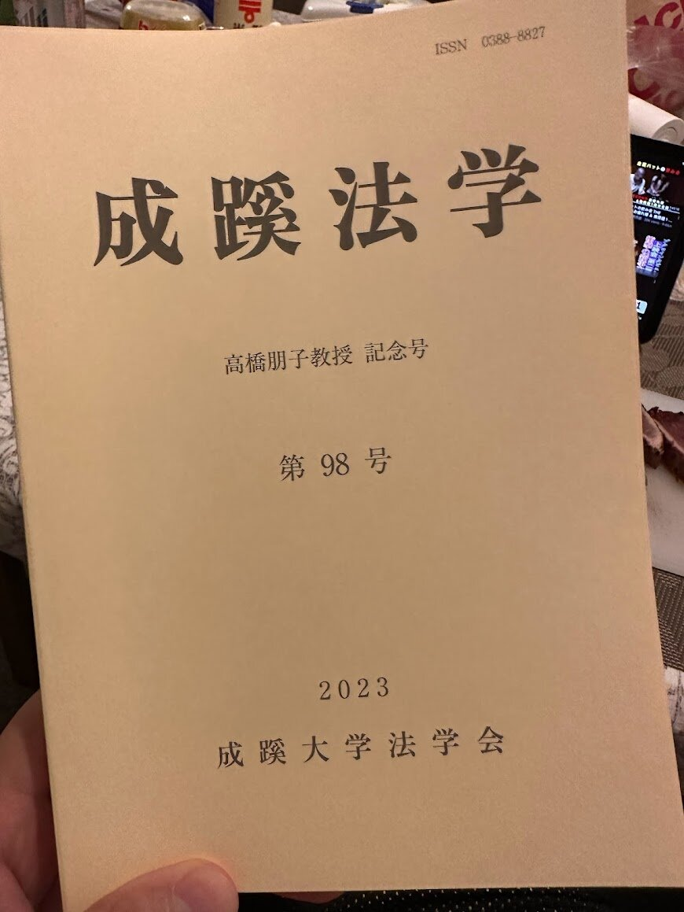

2023年6月末に発行された成蹊法学98号に「独占禁止法における「自己優遇」の実態と課題」というタイトルの論文を公表しました。

論文の内容は2022年に入ってすぐに取り組み始めた研究で、2022年の冬頃までに何回か関西経済法研究会や東北経済法研究会などでも報告したものの一部分を切り出して、論文としてブラッシュアップしたものになります。

実は、昨年のうちにデジタルプラットフォームビジネスにおける排除型行為規制というテーマで8万字程度の草稿を作っており、関西経済法研究会などではその草稿をもとに報告を行っていました。ただ、あまりにもテーマや論点が広く多岐にわたるため、ひとまずは全体の研究計画をすすめるための準備作業ということで、自己優遇に関する論点を取り上げて、今後の議論のために必要な議論状況や問題設定の整理を済ませておくという目的のもとに今回の論文を公表しました。

今後は、元になった草稿を敷衍させるかたちで数本の論文を公表していき、最終的に一つのまとまった研究にします。

今回の研究と並行して「独禁法とブロックチェーン技術の相補性」や「法解釈学的観点からの独禁法解釈論（特に形式主義に焦点をあてて）」、「独禁法の目的：経済厚生とイデオロギー」（CPRCディスカッション・ペーパー）も執筆中です（いずれも仮題）。

これらの仮題の並びを見ると色々な方向に興味関心が散らばっているように思われるかもしれませんが、意外と最終的には一つの方向に収斂していくのだろうと見込んでこれらの課題にあえて並行的に取り組んでいます。

我が事ながら研究の完成が楽しみです。

リポジトリのリンクは下記です。

> **[SEIKEI University Repository: 独占禁止法における「自己優遇」の実態と課題](http://repository.seikei.ac.jp/dspace/handle/10928/1620)**
>
> SEIKEI University Repository > 01：紀要(Bulletin) > 03：成蹊法学 > 第98号 > このアイテムのファイル:このリポジトリに保管されているアイテムは、他に指定されている場合を除き、著作権により保護されています。
