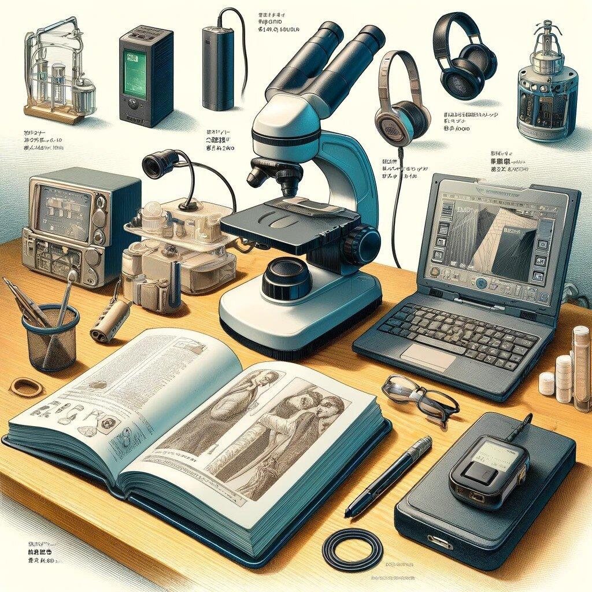

若手の方にちらっと聞かれたので自分の趣味も兼ねて、10万円以内で揃えるという制約のもと、法学専攻の大学院生がそろえやすい研究用の機材を考えてみました。

予算に限りがあるのでデスクトップPCは持たず、ノートPCのみの運用を前提としています。（私はMac派ではないのでWindows環境を前提にしていますが、ほとんどの製品は問題なくMacでも使えると思います）

最後のノートPCとスキャナを除き、モニターアームも含め概ね10万円以内で全部揃うはずです。机と椅子は持っている前提です！

---

**モニター**

法学の分野ではPDFやWordを使って作業することがほとんどなので、「ディスプレイの面積」がすなわち通常のオフィスでいう机などの「作業スペースの広さ」になります。ノートPCの小さな画面一枚で博論を仕上げることは別に可能だとは思いますが、わざわざやる必要は全くありません。ただし、ノートPC環境だとマルチディスプレイ環境を作り出すのが難しいです。そこで、最近手頃な価格で入手できるようになった34インチ以上のウルトラワイドモニタを使います。学部生時代にバイト代を根こそぎつぎ込んで5面ディスプレイくらいまで拡張したことがあったのですが、結局注意力散漫になり作業効率が落ちました。今は当時の反省を活かしてウルトラワイド1枚と27インチ1枚の構成にしています。

> **[Amazon.co.jp: LG モニター ディスプレイ 34WP550-B 34インチ/21:9 平面ウルトラワイド(2560×1080)/HDR/IPS 非光沢/FreeSync/75Hz/HDM](https://amzn.to/3qO68Sx)**

私が博士課程2年目で学振の科研費をもらったとき、まず最初に8万円近く出して購入したのがLGのウルトラワイドディスプレイ（韓国からの並行輸入品で当時は8万円でも格安）でした。共同研究室の狭い机に無理やりねじこんで使っていたら周りに散々冷やかされたのを思い出します。

いまでは当時よりはるかに高性能なものが3万円台前半で購入できますし、だいぶ普及したので冷やかされることもないでしょう。

モニターアームもあると視線が下に落ちず肩こりの解消に繋がります。リンクのモニタは6.8kgなのでおそらくAmazonベーシックあたりの3000円台のアームでも吊れないことはないのですが、そういうことをすると危ないので、なるべき1万円近くは出す覚悟でいたほうがいいかもしれないです。モニタを支える重要なパーツなので、お金に余裕があるならエルゴトロン一択になるんでしょうね...

---

**入力デバイス**

まずキーボードは予算控えめと言いつつ、RealforceのR3をおすすめします。

次点としてLogicoolのERGO K860がおすすめですが、キーが浅く、入力するときの力が強いと指の痛みが出やすいです。これは個人の好みもあると思いますが、G613は価格の割に指が痛くなりにくく、入力もしやすくて好きでした。どちらもそれぞれ２年ずつくらいは使ってきましたが、R3と比べてしまうと、どうしても打鍵量が増えるとバネ指の症状が出てしまって辛くなります。特に法学で博士論文を書くとなるととにかく入力する文字数が多いので、キーボードにはなるべく予算をかけたほうがいいと思います。ちなみに私は変荷重モデルを使っています。

> **[Amazon | REALFORCE リアルフォース 東プレ R3 キーボード 静音 変荷重 ハイブリッドモデル ワイヤレス Bluetooth USB 無線/有線両対応 テンキーレス 静電容量無接点](https://amzn.to/45LmZ7e)**
>
> REALFORCE リアルフォース 東プレ R3 キーボード 静音 変荷重 ハイブリッドモデル ワイヤレス Bluetooth USB 無線/有線両対応 テンキーレス 静電容量無接点方式 Windows iPad iPhone Android レーザー印刷 日本語配列 91キー …

> **[Amazon.co.jp: ロジクール ERGO K860 エルゴノミック スプリット キーボード bluetooth Unifying Windows Mac ワイヤレスキーボード ワイヤレス 無線](https://amzn.to/45uP0jR)**

> **[Amazon.co.jp: 【Amazon.co.jp限定】Logicool G ロジクール G ゲーミングキーボード ワイヤレス G613 LIGHTSPEED 無線 Bluetooth 接続対応](https://amzn.to/45OHkss)**

次に、マウスですが、腱鞘炎対策として、トラックボールマウスと通常のマウスの併用をおすすめします。トラックボールマウスは慣れるまでは苦労するかもしれませんが、モニタのサイズが上がるとマウスでの移動が面倒になってくるので早いうちに慣れておいたほうがいいと思います。

> **[Amazon.co.jp: 【Amazon.co.jp限定】ロジクール ワイヤレスマウス トラックボール 無線 M575S Bluetooth Unifying 5ボタン トラックボールマウス ワイヤ](https://amzn.to/3L0DeWc)**

通常のマウスは安くていいので、エルゴノミクスマウスと言われるものを使うと手首の負担を軽減できます。これは実際に私が学部時代に使っていた激安のマウスです。Logicoolのもののようにジェスチャー機能がついていたりといったメリットは一切ありませんが、これのおかげで右手首の痛みが相当に緩和されました。おすすめキーボードのR3はBluetooth接続時にやや電波干渉が気になるのですが、このマウスは安いのに2.4Ghzの無線ドングルで接続できるのでそこも安心です。

> **[Amazon.co.jp: Anker 2.4G ワイヤレスマウス (縦型 無線マウス) 800 / 1200 / 1600 DPI 5ボタン 光学式 エルゴノミクスデザイン 右手用 Windows](https://amzn.to/3PhQWXi)**

---

**Webカメラ・マイク**

院生時代はZoom程度でしかマイクを利用しないと思います。あの手のオンラインミーティング用のソフトは音声も映像もなかなかに圧縮されてしまうので、最低限の音質と画質が確保できれば研究報告程度であれば十分だったりします。というわけで、値段の割にはそこそこの画質と音質のC920nを導入し、あえてマイクは導入しないというのも一つの手段です。

> **[Amazon | 【Amazon.co.jp限定】ロジクール Webカメラ C920n フルHD 1080P ストリーミング オートフォーカス ステレオ マイク ブラック ウェブカメラ ウェブカム P](https://amzn.to/45OYbvi)**
>
> 【Amazon.co.jp限定】ロジクール Webカメラ C920n フルHD 1080P ストリーミング オートフォーカス ステレオ マイク ブラック ウェブカメラ ウェブカム PC Mac ノートパソコン Zoom Skype 国内正規品 2年間無償保証が家電＆カメラストアで…

---

**イヤホン・ヘッドホン**

長時間のZoom研究会をカナル型イヤホンで聴講していると早々に外耳炎になります。コロナ全盛期、私は最初の2ヶ月でAirpods Proの着け過ぎが原因で耳から謎の液体が止まらなくなりました。今も後遺症に悩まされています。最近は自宅では長時間のオンライン会議等のときだけ、偶然人からもらったVictorの骨伝導ヘッドホンを使っています。

> **[Amazon.co.jp: JVCケンウッド Victor ワイヤレスイヤホン nearphones 耳をふさがない ながら聴き テレワーク 耳掛け イヤーフック 最大17時間再生 Bluetooth](https://amzn.to/44tTmGy)**

ただ、ご覧の通りこの骨伝導ヘッドホン、高いです。なので、カナル型ではなく安定的に接続できて音質も悪くないイヤホンということで、AnkerのSoundcoreシリーズをおすすめします。私はこれを研究室に置きっぱなしにしていて、長い教授会はこれで乗り切っています。

> **[Amazon.co.jp: Anker Soundcore Life Note 3S（ワイヤレスイヤホン Bluetooth 5.2）【完全ワイヤレスイヤホン/インナーイヤー / IPX4防水規格 /](https://amzn.to/3YWPOv7)**
>
> オンライン通販のAmazon公式サイトなら、Anker Soundcore Life Note 3S（ワイヤレスイヤホン Bluetooth 5.2）【完全ワイヤレスイヤホン/インナーイヤー / IPX4防水規格 / 最大35時間音楽再生 / ワイヤレス充電/専用アプリ対応/PS…

---

**ノートPC・タブレット**

****

博士課程の生活においてなにより大切なのは論文を書くことです。もちろんタブレットでも外付けキーボードを利用してタイピングすることができますが、PC版のWordが使える（相互参照等の機能がちゃんと使えるという趣旨）という意味で、まずはちゃんとしたPCを持っておくことが大事です。Wordはメモリへの負担が重く、1ファイル内の文字数が5万字を超えている状態でコメント機能や変更履歴の記録を使おうものならWindows Meもびっくりのフリーズ状態になります。Wordで10万字以上の博論を書くつもりなら最低でも16GB程度はRAMを積んでおいたほうがいいです。私はD2から7年ほど（途中で1回同モデルの新型に買い替え）、LenovoのX1 carbonを使い続けています。理由は黒の筐体が好きだからと、安いからです。公式HPで好きなスペックにカスタマイズでき、なおかつ、いつも謎にすごい割引されます。学生ストアもあって、そこから学生価格で買えるはずです。同スペックのAsusやApple、Microsoft等の他社製品と比べると圧倒的に安いです。私は過去二回とも、RAM16GB、SSD1TB、i7くらいのスペックにしています。

個人的にはある程度のスペックのスマホを持っているのであれば、出先ではスマホでメモを取り論文を読み、タブレットは持たないというのが予算の制約がある環境では最適だと思っています。今はAdobe Acrobatのアプリで[リキッドモード](https://www.adobe.com/devnet-docs/acrobat/android/jp/lmode.html)というものが利用でき、だいたいのPDFファイルはスマホでも読みやすく再構成して表示してくれます。  
タブレットは論文を読むのに便利ですが、結局「論文を書く道具はPC」と割り切ってしまって、その分キーボードやモニタにお金をかけて自宅や研究室での作業効率を向上させ、体への負担を減らそうという考え方です。ただ、研究会中にスマホを眺めている様子が年配の先生方からはふざけているように見えてしまうというのも事実で、タブレットを持っていたほうが対人リスクは減らせるかもしれません。

> **[ThinkPad X1 Carbon Gen 9 | パワフルでポータビリティに優れたフラッグシップモデル](https://www.lenovo.com/jp/ja/p/laptops/thinkpad/thinkpadx1/x1-carbon-g9/22tp2x1x1c9?orgRef=https%253A%252F%252Fwww.google.com%252F#)**
>
> ThinkPad X1 Carbon Gen 9は、インテル® Evo™ プラットフォー ムを搭載した軽量プレミアムボディでパワフルなパフォーマンスのノートPCです。

---

**自炊環境について  
**

博士課程院生は修了後どこに就職するかもわからないので資料等は基本的にデータ化しておくことが望ましいのですが、予算を10万円以内とすると裁断機とスキャナの自炊セットを揃えるのは難しいです。ただ、最近の大学にはある程度Scansnapや裁断機が揃ってきていると思います。一応、山形大学も成蹊大学も、どちらも共同研究室的なところに自炊セットが置いてありました。京大のときには図書館に裁断機がありました。予算が許すのであればScansnapのix1300だけでも持っておくと便利だと思います。

\

> **[Amazon.co.jp](https://amzn.to/3supaxQ)**
>
> 申し訳ありませんが、お客様がロボットでないことを確認させていただく必要があります。最良のかたちでアクセスしていただくために、お使いのブラウザがクッキーを受け入れていることをご確認ください。

