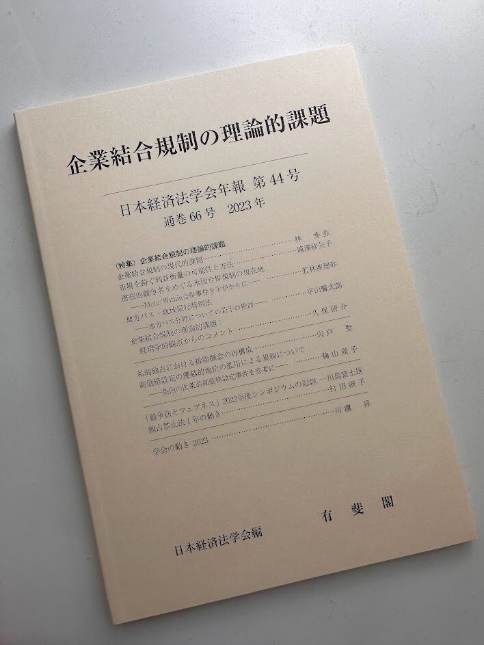

2022年10月に京都大学で行われた日本経済法学会での個別報告の内容が学会誌『企業結合規制の理論的課題』に「私的独占における排除概念の再構成」というタイトルの論説論文として収録されました。同タイトルの単著をもとに、学会報告での質疑応答を踏まえて加筆修正した文章になります。

今更昨年の学会の思い出話ですが、京大には在籍期間は短かったのですが、学内で過ごした時間は長く、思い出がたくさんあります。偶然にも自分が個別報告をする回の学会の開催校が京大でとても嬉しかったです。学会前日の夜は院生時代に通い詰めた[中華料理屋さん](https://tabelog.com/kyoto/A2601/A260302/26027794/)に行き、当日のお昼は共同研究室の院生でよく夕飯を食べに行った[定食屋さん](http://chotyoshi9.sakura.ne.jp/)に行き、そして夜は自分が京大に来たときに歓迎会をしてもらった[「くれしま」](https://tabelog.com/kyoto/A2601/A260302/26011460/)で食事をし、とても楽しい学会でした。

なんの偶然か、今年の12月にもまた[Ascola Asia](http://ascola-asia.com/ascolaasia2023)が京大で開催され、私はそこで個別報告をすることになりました。久しぶりの京都、楽しみです。

