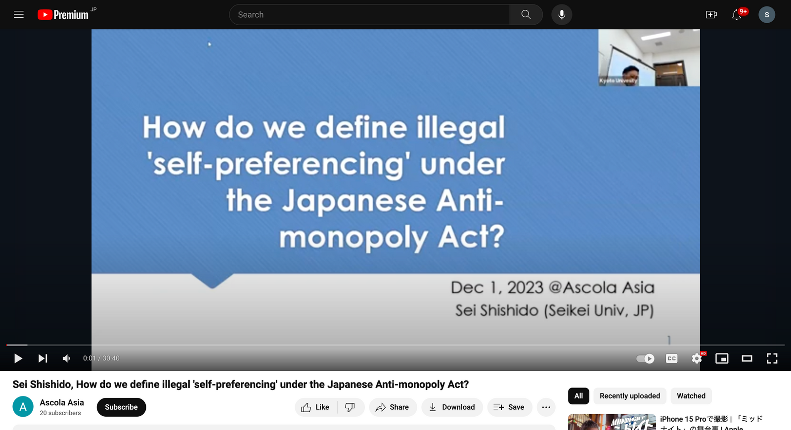

京都大学で開催されたAscola Asia 2023で、How do we define illegal \'self-preferencing\' under the Japanese Anti-monopoly Act? というタイトルの報告をしてきました。デジタルプラットフォームの自己優遇に関する報告です。

Asia版は2023年が初の開催ということもあり雰囲気もわからず、Ascolaの地方部会という位置付けで若手の気軽な学会くらいに認識していたのですが、蓋を開けてみれば参加している若手のレベルが恐ろしく高く、また、報告者の半数は実証系の内容を報告していたりと、とにかく刺激の強い大会でした。

特にシンガポール等の参加者のレベルは本当に高く、参加していたベテランの先生が「もしも自分が今彼らとジョブマーケットで争わなきゃいけないとしたらと想像するとゾッとする」と話されていたのが印象的でした。

日本では独禁法学者の数がそれほど多くなく競争も活発ではないので、今後のことを考えると今のうちにこういった経験ができて良かったです。下手したらAscola本体で発表した時よりレベルが高く、自分が当面目指さなければいけないレベル感がわかってきたように思えます。しばらく修行します。

補足：下記画像の通り、youtubeに動画が記載されておりますが、自己評価としてあまり出来が良くないためリンクはここには載せないでおきます...（せっかく掲載してくださった運営者の先生には申し訳ありません...せめてもの供養で画像だけ載せております）

> **[AscolaAsia2023 - ASCOLA_ASIA](https://www.ascola-asia.com/ascolaasia2023)**
>
> 1 December 2023, 10:00 - 17:00 (KST & JST)Hybrid (ZOOM & Kyoto University Main Campus) 10:00Martin LaiCity University of Hong KongRethinking…
