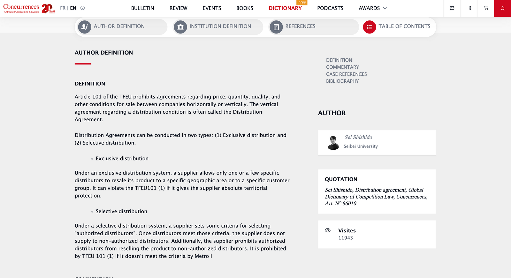

ConcurrencesのGlobal Dictionary of Competition Lawに「distribution agreement」の解説（commentary）を執筆しました。

Global Dictionary of Competition Lawは競争法に関わるタームを辞書形式で網羅しているデータベースで、各タームのページには言葉の定義に加え、学者や実務家等の専門家による解説が付されているという、かなり使い勝手の良いものです。データベースの収録内容は書籍としても適宜シリーズで刊行されているのですが、データベース自体はConcurrencesのウェブサイト上で無料で公開されており、私のような競争法関係の勉強をしている人間や、実務に携わる方々が気軽にアクセスできるという意味で、とてもありがたい取り組みです。  

私が担当したのはいわゆる流通契約全般で、主に垂直的制限の文脈で、流通に関する制限を課すような契約がEU、米国、日本で競争法上の問題となる場面と、vBERが適用される等、許容される場面について解説をしています。選択的流通や排他的流通については別項目がすでに設けられていて詳細な解説も付されているため、私の記事では概説的な説明を行うように心がけました。

将来的に印刷物として（おそらく書籍でしょうか）出版されるそうですので、もしも機会があればお手に取っていただけたら嬉しいです。

> **[Distribution agreement - Concurrences](https://www.concurrences.com/en/dictionary/distribution-agreement)**
>
> Agreements which concern the conditions for the purchase, sale or resale of the goods or services supplied by the supplier and/or which conc…
