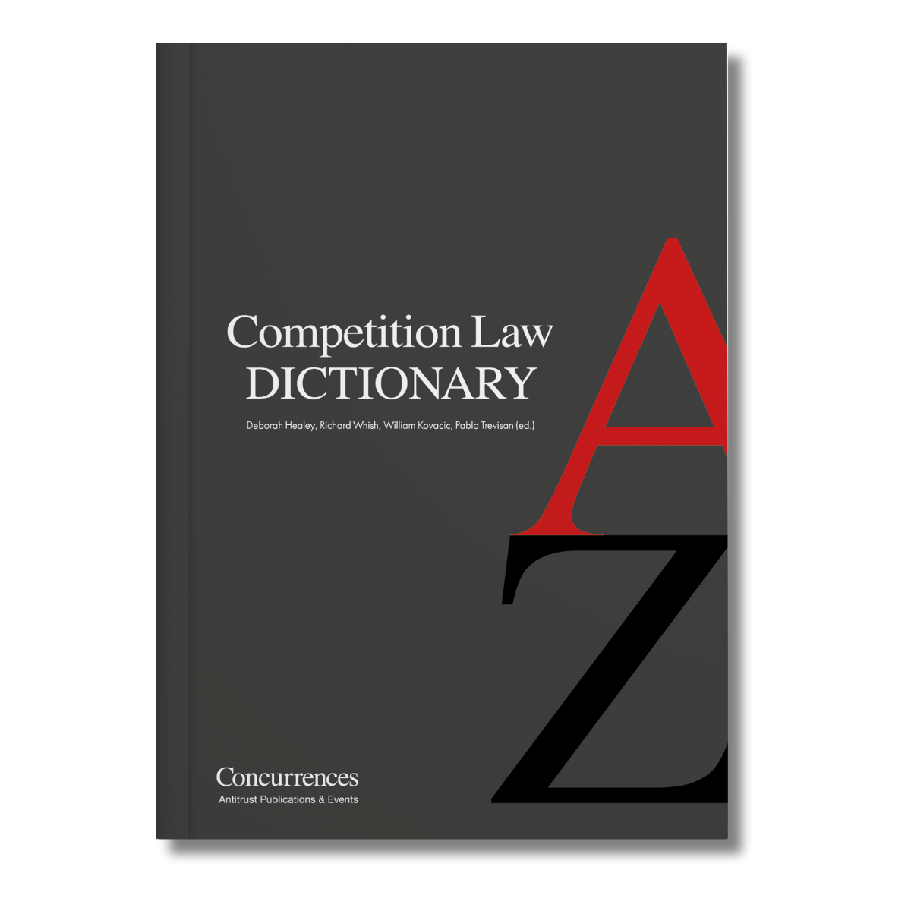

今年の上旬に公開された英語の[解説記事](https://sei-shishido.themedia.jp/posts/52111207?categoryIds=505654)が書籍に収録されました。ConcurrencesのCompetition Law Dictionaryという書籍です。

私はDistributuion agreementという項目で、垂直的制限について、EUのvBERの運用や米国の判例法を中心に紹介していますが、短いながらに日本法の紹介も頑張りました。

ぜひお手にとっていただけましたら幸いです。

> **[Competition Law Dictionary - Concurrences](https://www.concurrences.com/en/all-books/competition-law-dictionary)**
>
> The Competition Law Dictionary is a project dedicated to competition law worldwide, edited by Professors Deborah Healey (University of New S…

