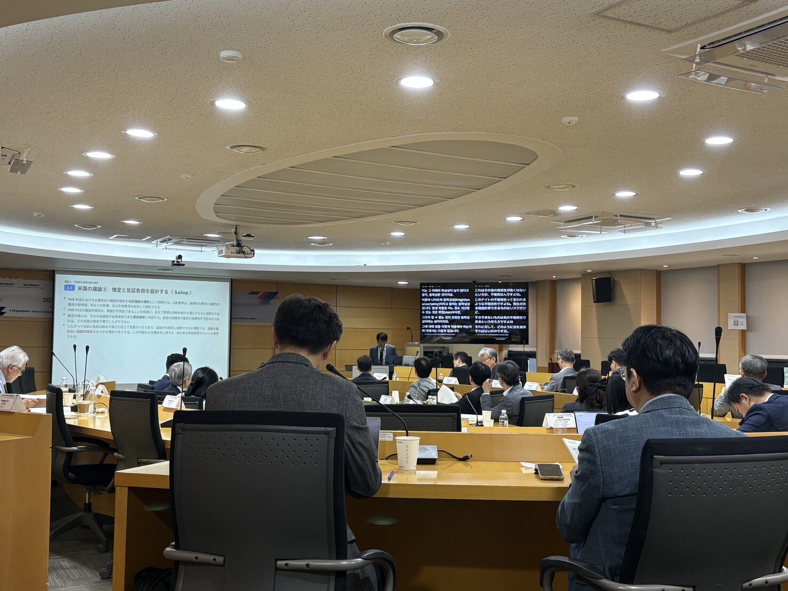

9月18日に、ソウルの高麗大学で開催された「2026 Korea-Japan Competition Law Academic Research Conference（2026 한일 경쟁법연구 학술교류대회）」で、「日本競争法の近年の展開──イノベーションを切り口に──」というタイトルの報告をしました。韓国競争法学会（KCLA）と日本経済法学会の共催で、韓国と日本の経済法研究者同士の交流を兼ねたカンファレンスです。

もともとは「日本競争法・政策の最近の展開」について話してほしい、というご依頼でした。ただ、日本の動向を網羅的に紹介するだけでは研究者同士で議論する素材になりにくいので、イノベーションを切り口にして、日本の競争法運用を批判的に検討するという形にしました。イノベーションを切り口にしたのは、近年の新しい論点をカバーしつつ、法運用の全体像も横断的に見渡せるからです。

報告のベースは、昨年[公正取引892号に書いた「競争者排除に向けた戦略的行動とイノベーション」](/blog/posts/2025-02-15-56397192/)と、[競争法フォーラムで報告した略奪的イノベーションの研究](/blog/posts/2024-03-22-52405552/)です。

独禁法においてイノベーションは、個別の行為の違法性を評価するときの考慮要素としても、競争政策の目的（ないし標語）としても出てきます。報告ではこの二つの軸に分けて整理しました。

前者については、行為類型ごとではなく「どの問いに答えようとしているのか」を基準に整理し直しました。正常なイノベーションと不当な排除をどう識別するのか、不確実な長期的な害をどの程度の確率で見込むのか、短期的な害と長期的な便益をどう衡量するのか、という三つの問いです。こう分けてみると、日本の事例や議論の蓄積は問いごとに大きく偏っていることがわかります。一つ目の問いには技術的抱き合わせをめぐるプリンター訴訟など少数ながら重要な事例がある一方で、二つ目の問いには事例がなく、三つ目の問いは企業結合の文脈で枠組みが示されたにとどまります。二つ目の問いについては、萌芽的競争者の買収をめぐるHemphill & Wuの議論や、推定と反証負担を誤判費用から設計するSalopの議論など、日本ではまだ十分に紹介されていない米国の議論も取り上げました。

後者については、公取委が2026年1月に公表した「イノベーションの促進に向けた競争政策の積極的展開」というステートメントと、同年6月の知的財産の取引に関する指針を取り上げました。優越的地位の濫用の枠組みのもとでは、「イノベーションの阻害」が悪影響として主張されるものの、それが実際に検証されることはない、という構造を指摘しています。

最後に救済措置の設計を取り上げ、公取委のGoogle命令とMCデータプラス命令を、米国のGoogle事件の最終判決と比べました。日本法は、違法性の判断ではイノベーションへの影響を害の理論に取り込んでいる一方で、救済の段階では技術の変化に対応できる設計になっていません。この非対称を、日本法の課題として示しました。あわせて、データの移行に応じることを命じたMCデータプラス命令は、この非対称への一つの答えであると同時に、救済を通じて実質的に新しい権利を作ることを、執行と立法のどちらが担うべきかという問いを投げかけている、という点も指摘しています。

とても刺激的な会で、今後、日韓の学術交流が活発になっていくことが期待できる素晴らしい会になったと思います。企画・運営にご尽力くださった日韓の先生方、会場でご質問・コメントをくださった皆様、本当にありがとうございました。
