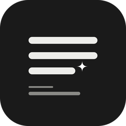
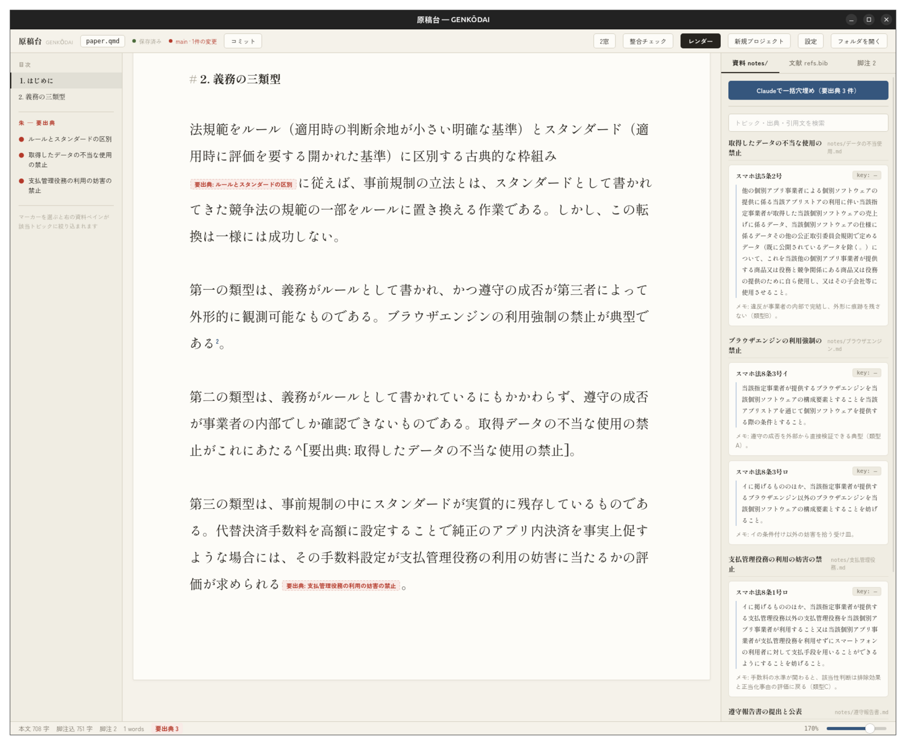
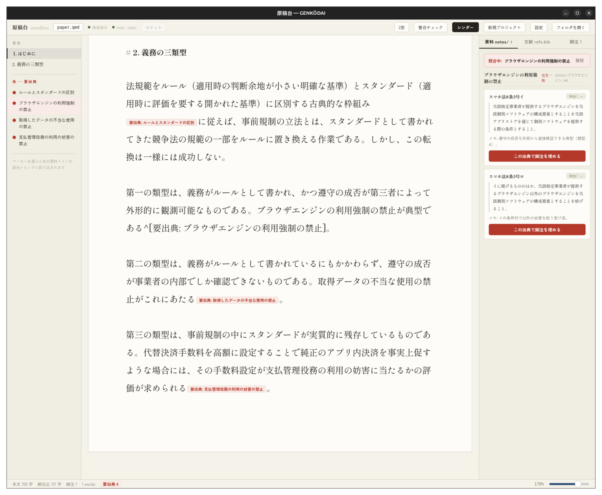
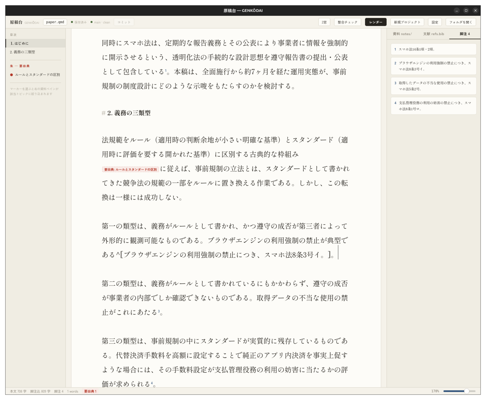
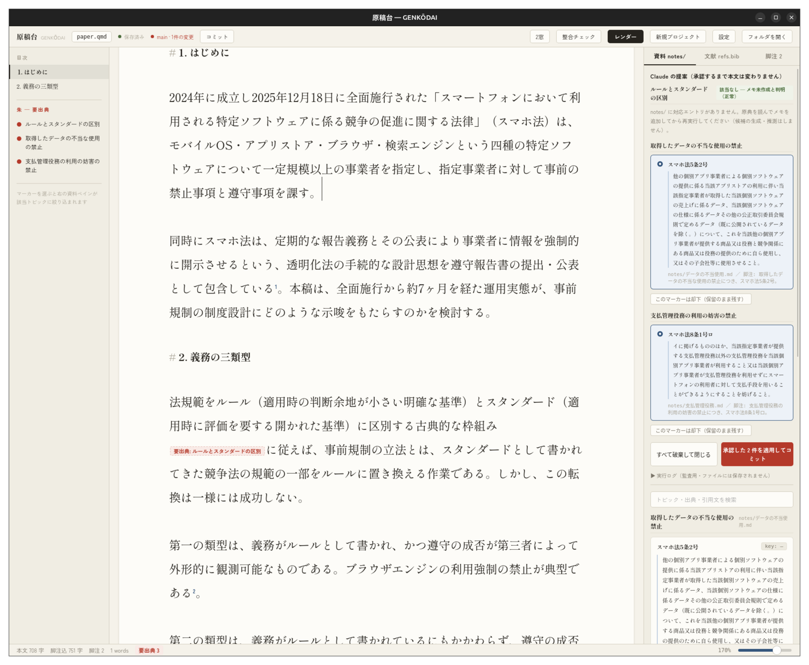
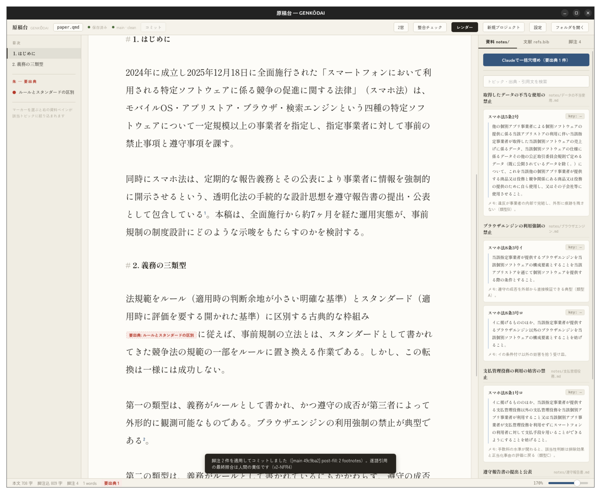

Linux/ Mac向けの論文執筆用エディタ「原稿台（Genkōdai）」を自作して、[GitHubで公開しました](https://github.com/sei914919/genkodai)。Quarto（.qmd）というMarkdownベースの形式で論文を書くための道具で、特に脚注に出典を付ける作業を楽にすることに特化しています。

{width="160" fig-align="center" fig-alt="原稿台のアイコン"}

実は2026年の7月くらいから、論文を書くのに基本的にWordを使うのをやめました。いちいち脚注を手入力するのが大変だったというのが一番の理由で、文献を読みながらメモをとる作業はどうせやるので、そのメモから適切な脚注を勝手に配置して、表記も整えてくれる、ということがやりたかったのです。それに、誤字脱字などのレビューのためにClaude Codeに原稿を読ませるときも、Markdownのファイルで書いておいたほうが何かと便利でした。あと、単純にWordは動作が重いし、UIもあまりきれいではないので、長時間向き合う道具としてはずっと不満がありました（Tauriというフレームワークで作ったアプリは、軽いし見た目もきれいです）。

原稿台での書き方は、端的には以下のとおりです。読んだ文献の抜き書きを、論文ごとではなくトピックごとのメモにためていき、一つひとつの抜き書きには「出典」「引用（原文そのまま）」「自分のメモ」をセットで書いておきます。本文を書いていて出典が必要になったら、その場では探さずに「要出典」の印だけ置いて先に進みます。あとでその印をクリックすると、該当するトピックの抜き書きが出典と原文のセットで並ぶので、原文を見ながら正しいものを選べば、ボタン一つで脚注に置き換わる、という仕組みです。該当する抜き書きがなければ「該当なし」と表示されるだけで、それらしい候補を勝手にでっち上げたりはしません。

公開しようと思ったのは、実態を知らない人からすると、Markdownで論文を書いているというのは、それこそClaude Codeに論文をまるごと生成させているように見えかねないからです。特に、原稿台から出力したWordファイルはプロパティを見ると作業時間が1秒とかになっているので、なおさらです...。それなら、発想と技術的な仕様をちゃんと公開しておくことが、自分の身を守ることにもなるのではないかと考えました。

実際のところ、原稿台を作るうえで一番気を使ったのは、AIに出典を作らせないことです。脚注の候補探しをClaude Codeに一括で任せる機能もあるのですが、Claudeにはファイルを読む権限しか与えておらず、原稿を書き換えることはできないようにしています。探してよいのは自分がとった抜き書きの中だけで、候補を出すときには必ず抜き書きの原文をそのまま写させ、その原文が本当にメモの中に一字一句存在するかをアプリの側で機械的に照合して、一致しないものは捨てるようにしました。「該当なし」は失敗ではなく、まだ読むべき文献が残っているということがわかった、という扱いです。最終的に採用するかどうかは一件ずつ自分で決めますし、実行の前後では自動で履歴（git）を残しているので、何がどう変わったのかは後から全部追えるようになっています。AIに論文を書かせるための道具というよりは、AIに書かせないための仕組みを組み込んだ道具、というのが実態に近いと思います。

なお、この記事のスクリーンショットは、公開用に作ったサンプル原稿を使っています。

とはいえ、自分の書き方に合わせて作った道具なので、メモのフォルダ構成など、前提となるやり方がそのまま必要になりますし、いまのところMacとLinuxでしか動きません。インストーラも用意していないので、使うにはソースからビルドする必要があります。デザインと名前はもう少しどうにかしたいと思っていて、Windows対応も含めて、そのうち改善したいです。ライセンスは、非商用であれば自由に使ったり改変したりできる形（PolyForm Noncommercial）にしました。設計書も一緒に公開しているので、道具そのものではなく、やり方だけを参考にしていただくのも大歓迎です。

自分の書き方に合わせて作業を効率化できて、しかもAIに無理な推論をさせないハーネシングがちゃんとできたエディタが作れた、という意味で、作っていてとても楽しかったですし、有意義でした。
