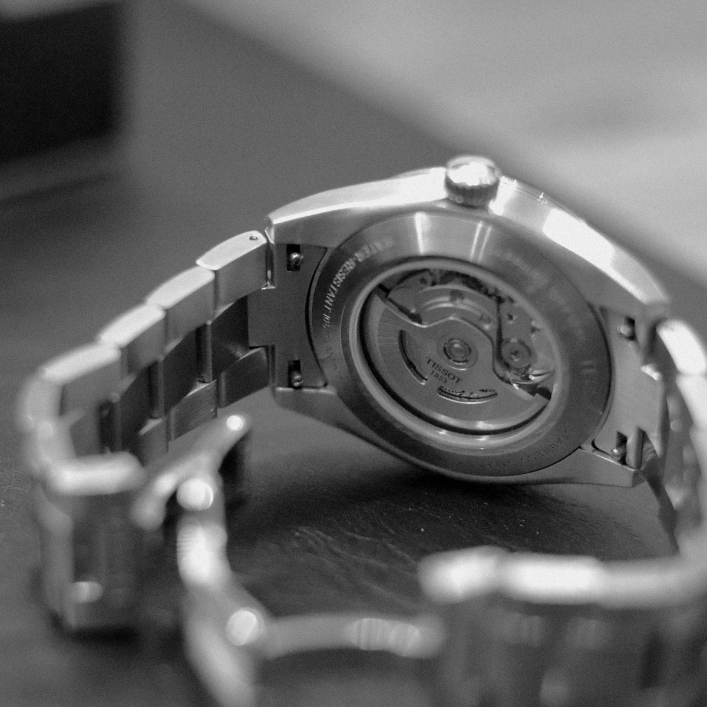
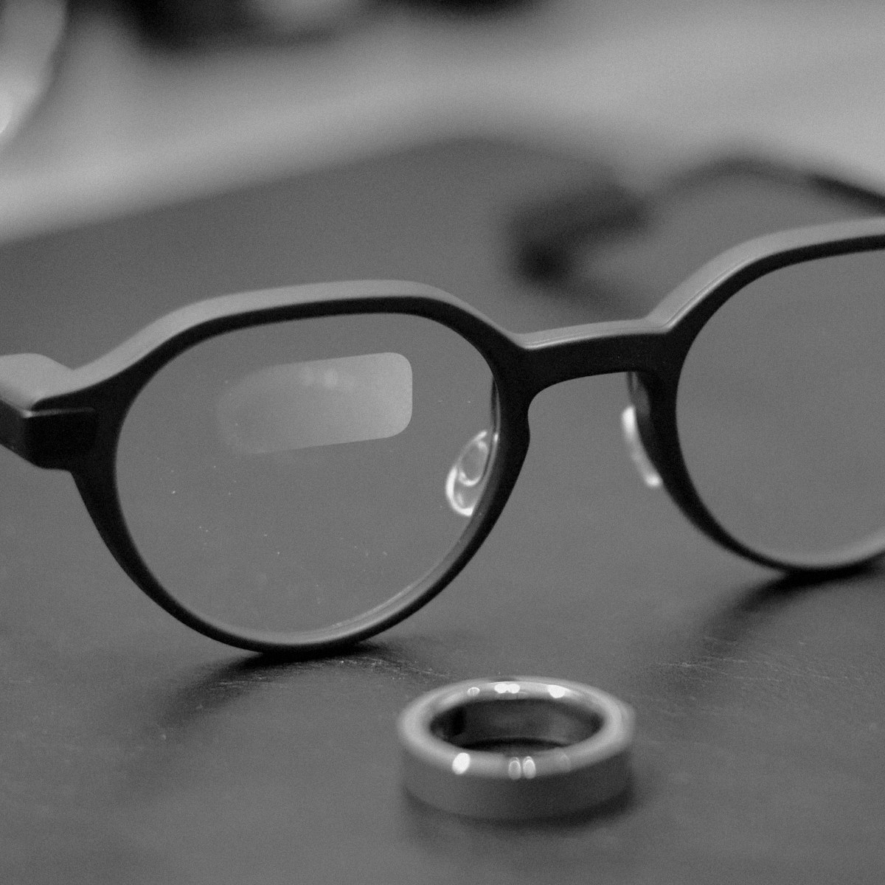

::: {.hero-grid}

::: {.hero-text}
[Issue 01 — Tōgane, May 2026]{.issue-mark}

::: name
Sei Shishido [宍戸　聖]{.jp}
:::

::: role
Associate Professor — Competition Law — Seikei University
:::

::: lede
独占禁止法・競争法を中心に、デジタル市場規制と日米欧比較の観点から研究を行っています。プラットフォームの自社優遇、アドテック、アルゴリズムによる競争への影響などが現在の主たる関心です。
:::
:::

::: {.hero-photos}
::: {.photo-cell .cell-1}
{fig-alt="研究室の書架"}
[01 / SHELF]{.photo-caption}
:::
::: {.photo-cell .cell-2}
{fig-alt="Tissot 機械式時計のムーブメント"}
[02 / MECHANISM]{.photo-caption}
:::
::: {.photo-cell .cell-3}
{fig-alt="Even Realities G2 スマートグラスとリング"}
[03 / TOOLS]{.photo-caption}
:::
::: {.photo-cell .cell-4}
{fig-alt="研究室の書架全景"}
[04 / STACKS]{.photo-caption}
:::
:::

:::

[Recent Works]{.section-label}

::: {#recent-works}
:::

[全業績を見る →](publications/index.qmd)

[Recent Posts]{.section-label}

::: {#recent-blog}
:::

[ブログ一覧 →](blog/index.qmd)
